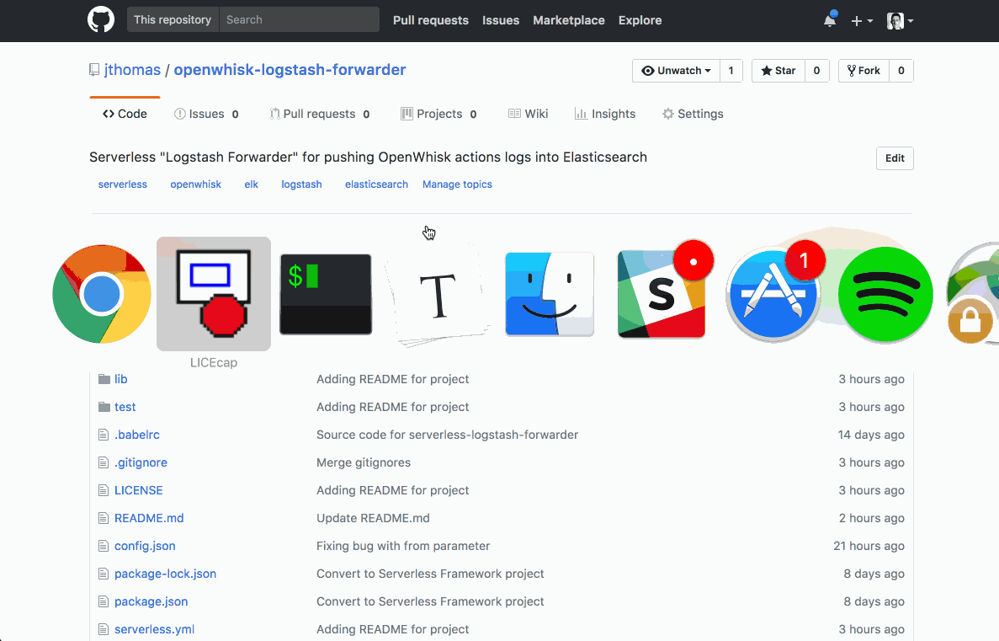
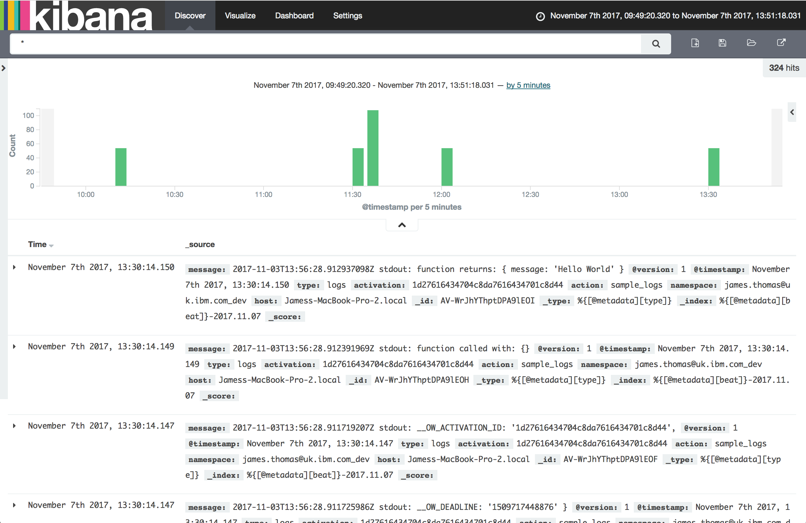

# openwhisk-logstash-forwarder

Serverless implementation of a "[logstash forwarder](https://michael.bouvy.net/blog/en/2013/12/06/use-lumberjack-logstash-forwarder-to-forward-logs-logstash/)" for [Apache OpenWhisk](http://openwhisk.incubator.apache.org/). 

Pushes [OpenWhisk actions logs](https://lornajane.net/posts/2017/debug-openwhisk-oneline-command-for-logs) into [ElasticSearch](https://www.elastic.co/) using [Lumberjack input](https://www.elastic.co/guide/en/logstash/current/plugins-inputs-lumberjack.html) for [Logstash](https://www.elastic.co/guide/en/logstash/current/index.html).



## usage

This project contains a single [OpenWhisk action](https://github.com/apache/incubator-openwhisk/blob/master/docs/actions.md) (`logstash-forwarder`). The action is scheduled to run on a timer using the [alarms trigger feed](https://github.com/apache/incubator-openwhisk-package-alarms).

**Each time the action is triggered, it retrieves and indexes all new log messages for monitored actions.**

Log messages are stored in the following format in action activation records.

```
2017-11-13T15:45:25.278483919Z stdout: log message content....
2017-11-13T15:45:25.278483919Z stderr: err message content....
```

The Lumberjack input for Logstash is used to push log messages into ElasticSearch.

Log messages are indexed with the following JSON object syntax.  

```json
{
  "line": "2017-11-13T15:45:25.278483919Z stdout: log message content....",
  "activation": "<ACTIVATION_ID>",
  "action": "<ACTION_NAME>",
  "namespace": "<ACTION_NAMESPACE>"
}
```

Using [Kibana](https://www.elastic.co/guide/en/kibana/index.html), log messages can be searched and monitored using dashboards.



## configuration

[Event parameters](https://github.com/apache/incubator-openwhisk/blob/master/docs/actions.md#passing-parameters-to-an-action) are used to control the runtime configuration properties. 

- `actions` - list of action names to monitor for logs.
- `from` - monitor logs since this unix time.
- `logstash` - [connection details](https://nodejs.org/api/tls.html#tls_tls_connect_options_callback) passed to client library.
  - `host` - logstash host name
  - `port` - logstash port

*Properties can be stored as [default parameters](https://github.com/apache/incubator-openwhisk/blob/master/docs/actions.md#setting-default-parameters) on the action or using alarm [trigger feed event parameters](https://github.com/apache/incubator-openwhisk-package-alarms#firing-a-trigger-event-periodically).*

## installation

This project needs an instance of OpenWhisk platform and an ELK-stack service accessible on a public IP address. 

### create openwhisk account

Register an account with an instance of the OpenWhisk platform. 

* *Want to use a hosted instance of the platform?*

  [IBM's cloud platform](https://www.ibm.com/cloud/) provides a managed OpenWhisk service, called [IBM Cloud Functions](https://console.bluemix.net/openwhisk/). Registered IBM Cloud accounts are entitled to a generous free tier for this service. **Want to sign up?** Follow this link: https://console.bluemix.net/registration/

* *Want to run the platform manually?*

  See [the instructions](https://github.com/apache/incubator-openwhisk#quick-start) in the open-source repository for different deployments options.

### elk-stack instance

There are many offerings for managed ELK services in the cloud. If you want to run a local instance for testing, follow these instructions…

- Use Docker to run a local instance of the ELK service.

  ```
  $ docker run -p 5601:5601 -p 5000:5000 -it --name elk sebp/elk:es241_l240_k461
  ```

- Use [Burrow.io](https://burrow.io/) to create public hostname and port from localhost port 5000.

- Visit Kibana [running on localhost](http://localhost:5601/) to check service is working.

### set monitoring configuration

Monitoring properties are configured in the `config.json` file. This controls the actions to monitor, log retrieval start time and logstash service details.

- Update the configuration file with the monitoring configuration properties.

  ```
  {
    "actions": ["sample_action"],   <-- list of action names
    "from": 0,                      <-- monitor logs from this unix time
    "logstash": {
      "host": "my_host.com",        <-- host name for logstash service
      "port": 5000                  <-- port for logstash service (5000)
      "rejectUnauthorized": false   <-- support use of self-signed certificates
    }
  }
  ```


### deploy

This project can be deployed using [The Serverless Framework](https://serverless.com/) or the [OpenWhisk CLI](https://github.com/apache/incubator-openwhisk-cli). 

#### using the serverless framework

- Install [The Serverless Framework](https://serverless.com) and [OpenWhisk provider plugin](https://github.com/serverless/serverless-openwhisk).

  ```
  $ npm install --global serverless serverless-openwhisk
  ```

- Register OpenWhisk account [credentials with the framework](https://serverless.com/framework/docs/providers/openwhisk/guide/credentials/).

- Run the [deploy command](https://serverless.com/framework/docs/providers/openwhisk/guide/deploying/).

  ```
  $ serverless deploy
  ```


#### using wsk cli

- Install the [OpenWhisk CLI](https://console.bluemix.net/openwhisk/cli) tool.

- Register OpenWhisk account credentials with the tool.

  ```
  $ wsk property set --apihost openwhisk.ng.bluemix.net --auth <API_KEY>
  ```

- Create action package from source files and dependencies.

  ```
  $ zip -r action.zip dist/ node_modules/ package.json
  ```

- Deploy action with default configuration parameters.

  ```
  $ wsk action create logstash-forwarder action.zip --kind nodejs:6 --param-file config.json
  ```

- Create trigger using feed from alarm package.

  ```
  $ wsk trigger create once-a-minute --feed /whisk.system/alarms/alarm --param cron "* * * * *"
  ```

- Bind action and trigger with a rule.

  ```
  $ wsk rule create index-logs once-a-minute logstash-forwarder
  ```


### monitoring processed logs

Once project resources are deployed, the `logstash-forwarder` action will be invoked once a minute.

Listing activation records shows the trigger being fired, which invokes the rule and runs the action.

```
$ wsk activation list
activations
feb935cd51ba4885b935cd51ba2885fe logstash-forwarder
40dc649bfd2b44219c649bfd2be421cd once-a-minute
a1616bce50d14340a16bce50d10340db index-logs
```

Check the logs from the `logstash-forwarder` action to see what activation records have been retrieved for the monitored actions.

```
$ wsk activation logs feb935cd51ba4885b935cd51ba2885fe
2017-11-20T15:12:05.620558134Z stdout: search activations (myaction) since 1511187779602
2017-11-20T15:12:05.680260278Z stdout: found 2 activations (myaction): 056b3d8d7ac04879ab3d8d7ac0a8793c, 8ac54796ab9c44fc854796ab9c04fc02
2017-11-20T15:12:05.988628046Z stdout: LAST_ACTIVATION myaction 1511188316441
```

## alternatives

This project "pushes" logs into ElasticSearch using the Lumberjack input plugin for Logstash. 

There is an [OpenWhisk plugin for Logstash](https://github.com/jthomas/logstash-input-openwhisk), which "pulls" log messages from the platform. The plugin makes Logstash responsible for polling the OpenWhisk platform for logs.

Using the plugin removes the need to run a custom action to manage log ingestion. However, many hosted ELK services do not allow the installation of custom plugins.

## development

The action code uses Node.js 8 features ([async/await](https://developer.mozilla.org/en-US/docs/Web/JavaScript/Reference/Statements/async_function)) that are not available on the default OpenWhisk Node.js runtime.

[Babel](https://babeljs.io/) is used to transpile the source code to overcome this issue. Use `npm run build` to run the build tools prior to deployment.

Unit tests are available in the `test` directory and can be executed with `npm test`.
